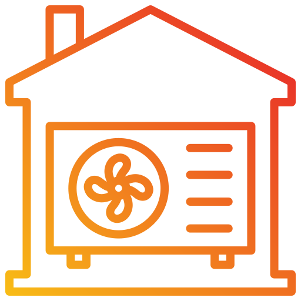

# Rego 6XX

Home Assistant integration (HACS) for IVT/Bosch heat pumps with Rego 600 control systems.  
It communicates with the **Rego600 REST API** app (FastAPI), which reads the heat pump via the serial port
and is located in the [`server/`-mapp](server/) directory, which contains the Dockerfile and docker-compose.yml.

## Installation

HACS → ⋮ → *Custom repositories* → `https://github.com/DewGew/rego6xx`, category **Integration** or click the button below

install → restart Home Assistant → *Settings → Devices & services → Add integration → Rego 6XX*.

Enter the **host**, **port** (default 8600), and **API key** (the same as `REGO_API_KEY`; leave blank if it is not used).  
The connection is validated using `GET /health` and `GET /api/v1/info`.

The polling interval for `/api/v1/status` (default 30 s, 15–300 s) can be changed under *Configure*.

## Entities

| Source in `/api/v1/status` | Platform | Details |
|---|---|---|
| `sensors` | sensor | °C → `temperature`, `%` for auxiliary heating; `state_class: measurement` |
| `power` | sensor | `power` (W), `measurement`. One value per component + total |
| `energy_total_kwh` | sensor | *Total energy*, `energy` (kWh), **`total_increasing`** |
| `display` | sensor | Display lines, diagnostics, **disabled by default** |
| `binary_sensors` | binary_sensor | `alarm` → problem, compressor/pumps → running |
| `leds` | binary_sensor | Diagnostics |
| `connected` | binary_sensor | *Serial connection* (connectivity). Other entities become unavailable when it is off |
| `settings` | number | `min`/`max`/`step` from the response, written via `POST /api/v1/settings/{key}` |
| fixed | button | `1`, `2`, `3`, `wheel_left`, `wheel_right` via `POST /api/v1/keys/{key}` |

- `unique_id` = `{entry_id}_{slug}`. The slug is the key in the response, with a prefix (`power_`, `energy_`, `display_`,
  `leds_`, `connection_`, `keys_`) for groups that share a platform.
- All entities share a `DeviceInfo` built from `/api/v1/info` (model, manufacturer, heat pump size, API version).
- After every POST, `coordinator.async_request_refresh()` is called.
- New entries in `/status` become new entities without requiring a restart.

> **Note:** `power` and `energy_total_kwh` are *estimates* in the API app (on/off × nominal power per
> heat pump size), not measured values.
